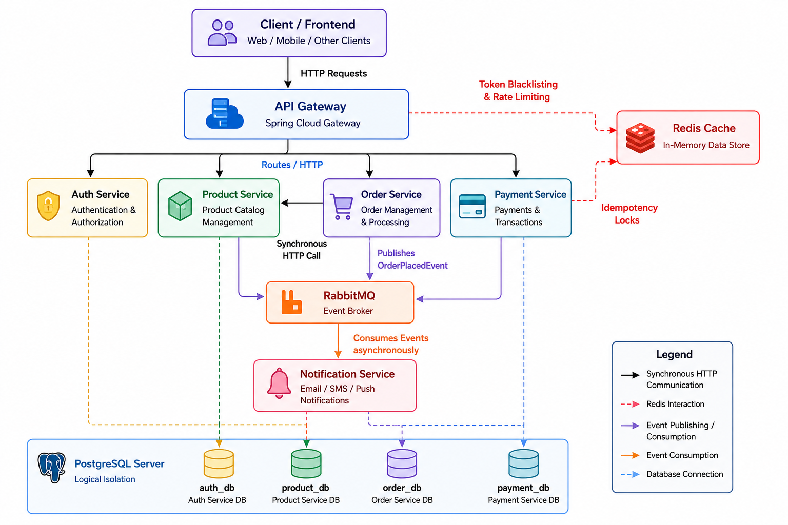

# Distributed E-Commerce Microservices Architecture

A highly scalable, distributed e-commerce backend built with **Java 21**, **Spring Boot 3**, and **Docker**. This project follows a production-inspired microservices architecture designed to support high concurrency, centralized security, asynchronous event-driven communication, and cloud-native scalability.

---

# System Architecture

<p align="center">
  
</p>

---

# Architectural Overview

This backend is designed around modern distributed system principles commonly used in production-scale applications.

### Castle & Moat Security Perimeter

All internal microservices reside inside a private Docker network.

The **API Gateway** acts as the only public entry point into the system. It takes the decision - Should this API request even be allowed into my backend ecosystem, and if so, to which service and under what policies?

It is responsible for:

- JWT Authentication & Verification
- Request Routing
- Redis Token Blacklisting
- Rate Limiting
- Request Logging

Internal services never expose themselves publicly and remain completely unaware of authentication concerns.

---

### Stateless Session Management

Since JWT authentication is stateless, traditional server-side sessions do not exist.

To support secure logout:

- The Auth Service places revoked JWTs into a **Redis blacklist**
- Each entry is stored with the token's remaining TTL
- Every incoming request is checked by the API Gateway with an **O(1)** Redis lookup

This prevents replay attacks using previously valid JWTs.

---

### CAP-Theorem Aware Rate Limiting

Redis is also used for distributed request throttling. 

The gateway implements different failure strategies depending on endpoint sensitivity:

| Route | Behaviour |
|--------|-----------|
| `/orders` | Fail Closed |
| `/auth` | Fail Closed |
| `/products` | Fail Open |

This balances **Consistency**, **Availability**, and **Security** depending on business requirements. For something like scrolling of product catalogues, we can have the rate limiting as always available and then relying on eventual consistency and the service may not be down that time. But in case of sensitive operations like payments, the rate limiting has to be strongly consistent and if the rate limiter is offline, system may have to be taken offline for protected transactions. 

---

### Database-per-Service

Although all services share a single PostgreSQL server physically, each service owns an independent logical database.

```
PostgreSQL Server
│
├── auth_db
├── product_db
├── order_db
└── payment_db
```

Each service exclusively owns its own schema.

No service performs cross-database joins.

All communication occurs strictly through APIs or asynchronous events.

---

### Hybrid Service Communication

The architecture combines synchronous and asynchronous communication.

#### Synchronous HTTP

Used whenever immediate consistency is required.

Example:

```
Order Service
      │
      ▼
Product Service
```

Before creating an order, the Order Service verifies product availability through a REST API call.

---

#### Asynchronous Messaging

RabbitMQ is used for background processing.

Example flow:

```
Order Created
      │
      ▼
RabbitMQ
      │
      ▼
Notification Service
```

This allows emails, SMS notifications, and other background tasks to execute without blocking user requests.

The architecture is also designed to evolve into a **Saga-based distributed transaction system**.

---

### High Concurrency

All synchronous services leverage **Java 21 Virtual Threads (Project Loom)**.

Benefits include:

- Thousands of concurrent HTTP requests
- Massive concurrent database operations
- Lower memory consumption
- Simpler imperative programming model

without the complexity of reactive programming across every service.

---

#  Tech Stack

| Category | Technology |
|-----------|------------|
| **Language** | Java 21 |
| **Framework** | Spring Boot 3.x |
| **Gateway** | Spring Cloud Gateway |
| **Web Server** | Netty (WebFlux) |
| **Database** | PostgreSQL |
| **Cache** | Redis |
| **Message Broker** | RabbitMQ |
| **Security** | JWT (jjwt) |
| **Containerization** | Docker & Docker Compose |
| **Concurrency** | Java 21 Virtual Threads |

---

# Microservices

| Service | Port | Responsibilities |
|-----------|------|------------------|
| **API Gateway** | 8080 | Reverse proxy, JWT validation, routing, rate limiting, Redis blacklist |
| **Auth Service** | 8081 | User authentication, JWT issuance, logout management |
| **Product Service** | 8082 | Product catalog and inventory management |
| **Order Service** | 8083 | Checkout workflow, stock verification, order creation |
| **Notification Service** | 8084 | Asynchronous email/SMS notifications |
| **Payment Service** *(Planned)* | 8085 | Payment processing with Redis-backed idempotency |

---

# Running the Project

## Prerequisites

- Java 21 JDK
- Docker Desktop
- Docker Compose

---

## Clone Repository

```bash
git clone https://github.com/<your-username>/distributed-ecommerce.git
cd distributed-ecommerce
```

---

## Build All Services

Compile every Spring Boot microservice.

```bash
./mvnw clean package -DskipTests
```

---

## Start the Entire Cluster

```bash
docker-compose up --build -d
```

This starts:

- PostgreSQL
- Redis
- RabbitMQ
- API Gateway
- Auth Service
- Product Service
- Order Service
- Notification Service

Wait approximately **20–30 seconds** before sending requests.

---

## Verify Deployment

Check the gateway logs.

```bash
docker logs api-gateway
```

---

# Cleanup

Stop the cluster.

```bash
docker-compose down
```

Remove unused Docker layers.

```bash
docker system prune -f
```

---

# Project Highlights

- API Gateway architecture
- JWT Authentication
- Redis Token Blacklisting
- Distributed Rate Limiting
- RabbitMQ Event-Driven Communication
- Database-per-Service Design
- Idempotent Transactions in Payment Microservice
- Java 21 Virtual Threads
- Dockerized Microservices
- Production-inspired Service Isolation

---

# Future Enhancements

## Saga Pattern

Implement distributed transactions for:

- Inventory Reservation
- Payment Confirmation
- Automatic Rollbacks
- Compensation Events

---

## Distributed Tracing

Integrate:

- OpenTelemetry
- Zipkin

for complete request tracing across every microservice.

---

## Centralized Exception Handling

Introduce shared error contracts using:

- `@ControllerAdvice`
- Global Exception Handlers

to provide consistent API responses.

---

## Service Discovery

Integrate **Netflix Eureka** for dynamic service registration and horizontal scaling.

---

## API Documentation

Generate interactive REST documentation using:

- SpringDoc OpenAPI
- Swagger UI

---

# Learning Objectives

This project demonstrates practical implementation of several distributed systems concepts:

- Microservices Architecture
- API Gateway Pattern
- Event-Driven Architecture
- Stateless Authentication
- Distributed Caching
- Rate Limiting
- Database-per-Service
- Asynchronous Messaging
- High-Concurrency Backend Design
- Cloud-Native Deployment