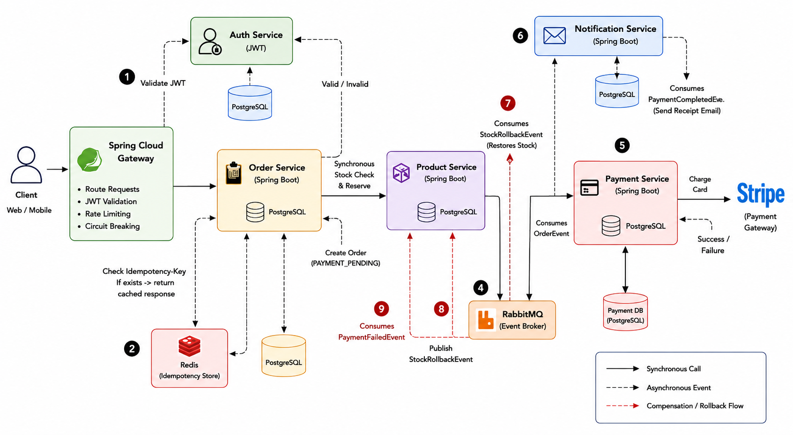

# Distributed E-Commerce Backend

> A production-inspired distributed e-commerce platform built with **Java 21**, **Spring Boot 3**, **Docker**, **RabbitMQ**, **Redis**, and **PostgreSQL**. The project demonstrates enterprise backend architecture through microservices, Saga-based distributed transactions, stateless authentication, event-driven communication, and scalable system design.

---

# Overview

Modern e-commerce systems are far more than CRUD applications. They must process concurrent requests, coordinate multiple independent services, recover gracefully from failures, and maintain consistency across distributed components.

This project explores those engineering challenges by implementing a production-inspired checkout system composed of independently deployable microservices.

The architecture demonstrates:

- Database-per-Service architecture
- Saga Choreography for distributed transactions
- Stateless JWT authentication
- API Gateway security perimeter
- Redis-backed idempotency & token blacklisting
- RabbitMQ event-driven messaging
- Java 21 Virtual Threads
- Eventual consistency
- Independent service scalability

Rather than focusing only on framework usage, the project emphasizes architectural trade-offs commonly encountered in real-world distributed systems.

---

# System Architecture

<p align="center">
    
</p>

The system is designed around loose coupling, clear ownership boundaries, and fault isolation.

Every microservice owns a single business capability and communicates with other services exclusively through REST APIs or asynchronous events.

---

# Core Design Principles

The architecture follows several principles commonly adopted in production distributed systems.

- Single Responsibility per Microservice
- Database-per-Service Pattern
- Bounded Contexts
- Stateless Authentication
- Event-Driven Communication
- Eventual Consistency
- Failure-Oriented Design
- Horizontal Scalability
- High-Concurrency Processing
- Loose Coupling via Messaging

---

# Engineering Decisions

Instead of optimizing only for functionality, this project prioritizes maintainability, scalability, and resilience.

---

## 1. Castle & Moat Security

All business services reside inside an isolated Docker network.

The **Spring Cloud Gateway** is the **only public entry point** into the system.

The gateway is responsible for:

- JWT signature verification
- Authentication
- Authorization
- Request routing
- Rate limiting
- Token blacklist validation
- Request filtering

Internal microservices remain completely unaware of authentication logic.

This significantly reduces security complexity and follows the "Castle & Moat" architectural pattern.

---

## 2. Stateless Authentication

The platform uses cryptographically signed JWT tokens.

Since JWTs are stateless, logout cannot invalidate tokens automatically.

To solve this:

- revoked tokens are stored inside Redis
- Redis entries expire automatically using TTL
- Gateway performs O(1) blacklist lookups

This preserves stateless authentication while preventing replay attacks.

---

## 3. Redis-backed Idempotency

Financial APIs cannot rely on clients behaving correctly.

If a user clicks **Place Order** twice, the backend must guarantee that payment executes only once.

Every checkout request includes an

```
Idempotency-Key
```

The Order Service:

- acquires a Redis lock
- detects duplicate requests
- immediately returns the cached response
- prevents duplicate payment processing

This mirrors production payment systems such as Stripe.

---

## 4. Database-per-Service

Although all services share a single PostgreSQL container, each microservice owns an isolated logical database.

```
auth_db
product_db
order_db
payment_db
```

No service performs SQL joins across another service's schema.

Instead, services communicate through:

- synchronous REST
- asynchronous RabbitMQ events

This maintains loose coupling and enables independent deployments.

---

## 5. Choosing Synchronous vs Asynchronous Communication

Different operations require different communication models.

### Synchronous REST

Used whenever immediate consistency is required.

Example:

```
Order Service
      │
      ▼
Product Service
```

Inventory must be reserved before checkout continues.

This prevents overselling.

---

### Asynchronous Messaging

Used whenever the client should not wait for downstream processing.

```
Order Service

↓

RabbitMQ

↓

Notification Service
```

Checkout returns immediately while emails are processed in the background.

This reduces latency and isolates slow downstream services.

---

## 6. Why Payment is an Independent Service

Payment processing is intentionally isolated instead of being embedded inside the Order Service.

Reasons include:

- PCI-DSS security boundaries
- independent deployment
- gateway abstraction
- anti-corruption layer
- easier migration between payment providers
- long-running payment workflows

If Stripe is replaced with Razorpay, only the Payment Service changes.

The remainder of the platform remains untouched.

---

## 7. Middleware Request Pipeline

Every request entering the system flows through a chain of Gateway filters.

```
Incoming Request

↓

Logging Filter

↓

Authentication Filter

↓

JWT Validation

↓

Rate Limiting

↓

Redis Blacklist Check

↓

Routing

↓

Microservice
```

Each filter has a single responsibility, improving maintainability and extensibility.

---

## 8. High-Concurrency Processing

Blocking workloads such as:

- database queries
- HTTP requests
- RabbitMQ communication

are handled using **Java 21 Virtual Threads (Project Loom)**.

Compared with traditional thread-per-request models, virtual threads allow significantly higher concurrency while consuming fewer operating system resources.

---

## 9. Failure-Oriented Design

Distributed systems must assume failures will occur.

Examples include:

- network timeouts
- duplicate client retries
- service crashes
- RabbitMQ consumer downtime
- payment gateway latency

Instead of attempting to eliminate failures, the architecture is designed to recover from them safely.

---

## 10. Eventual Consistency

Traditional ACID transactions cannot span multiple independent databases.
Instead, the platform embraces eventual consistency through Saga Choreography.
Every microservice commits only its own local transaction.
Cross-service consistency is achieved through asynchronous domain events.

---

# Distributed Transactions (Saga Choreography)

<p align="center">
    
</p>

The checkout workflow coordinates multiple independent services without distributed locks or two-phase commit.

---

## Checkout Lifecycle

### Step 1

The client sends a request through the API Gateway.

The Gateway:

- authenticates JWT
- validates blacklist
- routes request

---

### Step 2

Order Service validates the Idempotency-Key.

Duplicate submissions immediately return the cached response.

---

### Step 3

Order Service synchronously contacts Product Service.

Inventory is reserved before payment begins.

---

### Step 4

The Order is stored as

```
PAYMENT_PENDING
```

and an `OrderCreatedEvent` is published to RabbitMQ.

---

### Step 5

Payment Service consumes the event.

Payment processing begins independently.

---

### Success Path

```
PaymentCompletedEvent

↓

Order Status = COMPLETED

↓

Notification Service

↓

Email Sent
```

---

### Failure Path

```
PaymentFailedEvent

↓

Order Status = PAYMENT_FAILED

↓

StockRollbackEvent

↓

Inventory Restored
```

Instead of global transactions, compensation events restore consistency across services.

---

# Scalability Strategy

Every microservice is independently deployable and horizontally scalable.

```
                 API Gateway
                      │
      ┌───────────────┼───────────────┐
      │               │               │
   Order x4       Product x2      Payment x6
```

Because services remain stateless, additional replicas can be launched without architectural changes.

Independent scaling reduces infrastructure cost while improving throughput.

---

# Technology Stack

| Category | Technology |
|-----------|------------|
| Language | Java 21 |
| Framework | Spring Boot 3 |
| API Gateway | Spring Cloud Gateway |
| Database | PostgreSQL |
| Cache | Redis |
| Messaging | RabbitMQ |
| Security | JWT |
| Containerization | Docker & Docker Compose |
| Concurrency | Java 21 Virtual Threads |

---

# Microservices

| Service | Port | Responsibility |
|----------|------|----------------|
| API Gateway | 8080 | Routing, authentication, authorization, rate limiting |
| Auth Service | 8081 | User registration, login, JWT issuance |
| Product Service | 8082 | Product catalog and inventory management |
| Order Service | 8083 | Checkout workflow, idempotency, order lifecycle |
| Payment Service | 8085 | Payment processing and Saga events |
| Notification Service | 8084 | Email and notification processing |

---

# Running the Project

## Prerequisites

- Java 21
- Maven
- Docker Desktop
- Docker Compose

---

## Clone

```bash
git clone https://github.com/Divyansh745Garg/distributed-commerce.git

cd distributed-ecommerce
```

---

## Build

```bash
./mvnw clean package -DskipTests
```

---

## Start

```bash
docker compose up --build -d
```

Wait approximately 30 seconds for PostgreSQL, Redis, and RabbitMQ to initialize.

---

## Verify

```bash
docker compose ps
```

or

```bash
docker compose logs api-gateway
```

---

# Testing the Checkout Flow

## Authenticate

```
POST /api/v1/auth/login
```

Retrieve the generated JWT.

---

## Create an Order

```
POST /api/v1/orders
```

Headers

```
Authorization: Bearer <JWT>

Idempotency-Key: order-001
```

Body

```json
{
  "userId": "user-123",
  "items": [
    {
      "productId": "<PRODUCT_UUID>",
      "quantity": 2
    }
  ]
}
```

---

## Verify Idempotency

Repeat the same request using the same `Idempotency-Key`.

The cached response is returned immediately without executing payment again.

---

## Simulate Payment Failure

Observe:

```bash
docker compose logs -f
```

Saga execution:

```
OrderCreatedEvent

↓

PaymentFailedEvent

↓

StockRollbackEvent

↓

Inventory Restored
```

---

# Project Structure

```
distributed-ecommerce
│
├── api-gateway
├── auth-service
├── product-service
├── order-service
├── payment-service
├── notification-service
│
├── docker-compose.yml
├── pom.xml
└── README.md
```

---

# Future Improvements

- OpenTelemetry distributed tracing
- Zipkin integration
- Resilience4j circuit breakers
- Kafka event streaming
- Kubernetes deployment
- GitHub Actions CI/CD
- Prometheus & Grafana monitoring
- Service Discovery using Eureka
- Cache-aside strategy for product catalog
- Reconciliation jobs for payment verification

---

# Concepts Demonstrated

- Distributed Systems
- Microservices Architecture
- Domain-Driven Service Boundaries
- Saga Choreography
- Event-Driven Architecture
- Stateless Authentication
- JWT Security
- Redis Idempotency
- RabbitMQ Messaging
- Eventual Consistency
- Failure Recovery
- High-Concurrency Backend Design
- Horizontal Scalability
- Enterprise Backend Engineering