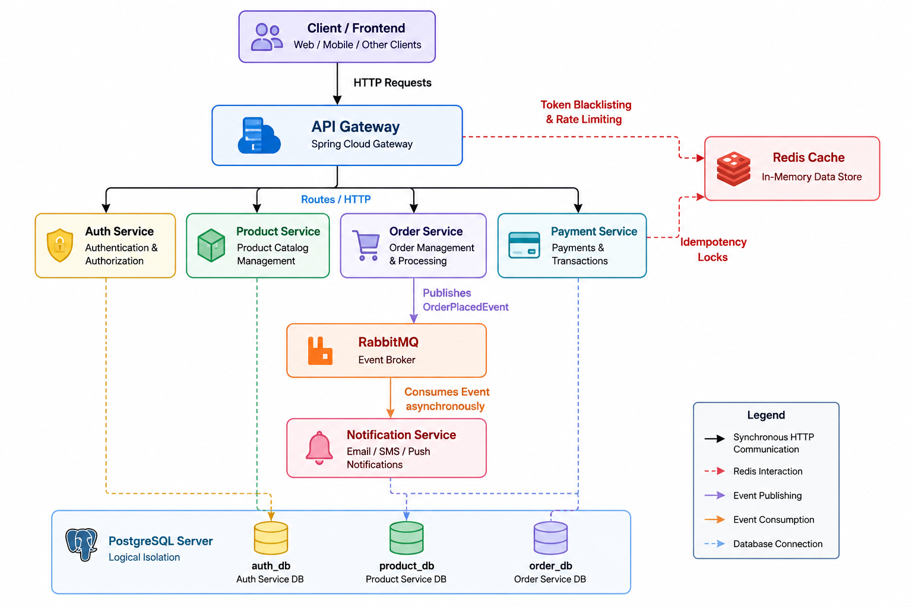

<<<<<<< HEAD
# Distributed E-Commerce Backend

=======
[//]: # (# Distributed E-Commerce Microservices Architecture)

[//]: # ()
[//]: # (An event-driven, containerized e-commerce backend designed to demonstrate modern distributed system patterns, including centralized perimeter security, asynchronous messaging, and distributed caching for transactional idempotency.)

[//]: # ()
[//]: # (## System Architecture)

[//]: # ()
[//]: # ([![System Architecture Diagram]&#40;./image/Architecture.png&#41;]&#40;./image/Architecture.png&#41;)

[//]: # (This architecture utilizes a **"Castle and Moat" perimeter security model**. All internal microservices are isolated within a private Docker network and are inaccessible from the outside world. All traffic must pass through the API Gateway which makes a decision @ the starting - Should this API request even be allowed into my backend ecosystem, and if so, to which pirticular micro-service and under what policies?.)

[//]: # ()
[//]: # (### Core Flows:)

[//]: # (1. **Authentication Offloading:** The `api-gateway` , operating at the L7 &#40;Application Layer&#41; intercepts all incoming requests, extracts the JWT, and cryptographically verifies it using a shared secret. If valid, it routes the traffic to downstream services. Downstream services do not contain security dependencies.)

[//]: # (2. **Transactional Idempotency:** The `order-service` leverages Redis to hash and store incoming `Idempotency-Key` headers. This prevents duplicate database entries or double-charging if a user clicks "Checkout" multiple times.)

[//]: # (3. **Event-Driven Messaging:** Upon saving an order to PostgreSQL, the `order-service` publishes an `OrderEvent` to a RabbitMQ exchange. The `notification-service` consumes this queue asynchronously, ensuring the main user thread is never blocked by email/SMS processing delays.)

[//]: # ()
[//]: # (## Tech Stack)

[//]: # (* **Language:** Java 21)

[//]: # (* **Framework:** Spring Boot 3.x, Spring Cloud Gateway)

[//]: # (* **Security:** JSON Web Tokens &#40;jjwt&#41;)

[//]: # (* **Databases:** PostgreSQL &#40;Relational&#41;, Redis &#40;Distributed Cache&#41;)

[//]: # (* **Message Broker:** RabbitMQ)

[//]: # (* **Containerization:** Docker & Docker Compose)

[//]: # ()
[//]: # (## Microservices Breakdown)

[//]: # ()
[//]: # (| Service | Port | Description |)

[//]: # (| :--- | :--- | :--- |)

[//]: # (| `api-gateway` | `8080` | The single entry point. Handles routing and JWT validation &#40;The Bouncer for the Resource Servers&#41;. |)

[//]: # (| `auth-service` | `8081` | Authorization Server. Issues cryptographically signed JWTs &#40;Bearer Tokens&#41;|)

[//]: # (| `product-service`| `8082` | Resource Server. Manages product catalog. Isolated behind the Gateway. |)

[//]: # (| `order-service` | `8083` | Resource Server. Handles checkout logic, Redis idempotency checks, and publishes events. |)

[//]: # (| `notification-service`| `8084` | Background worker that consumes RabbitMQ queues to simulate emails. |)

[//]: # ()
[//]: # (## Local Development & Testing)

[//]: # ()
[//]: # (### Prerequisites)

[//]: # (* Java 21 & Maven installed locally.)

[//]: # (* Docker Desktop installed and running.)

[//]: # ()
[//]: # (### 1. Build the Microservices)

[//]: # (Run this from the root directory to compile all Java modules into `.jar` files:)

[//]: # (```bash)

[//]: # (mvn clean package -DskipTests)

# Distributed E-Commerce Backend

>>>>>>> dad60ad (feat: implement Order database, weak entities, and REST client)
A highly scalable, distributed e-commerce backend built with **Java 21**, **Spring Boot 3**, and **Docker**. This project follows a microservices architecture designed to support high concurrency, resilient payment processing, asynchronous event-driven communication, and cloud-native scalability.

## System Architecture

[](./image/Architecture2.png)

---

# ✨ Features

- 🚀 **Microservices Architecture**
<<<<<<< HEAD
  - Independent Spring Boot services with clear separation of responsibilities.
  - Easy horizontal scaling and independent deployments.

- 🌐 **Spring Cloud Gateway**
  - Centralized entry point for all incoming traffic.
  - Built using Spring WebFlux and Netty.
  - Supports:
    - JWT Authentication
    - Rate Limiting
    - Request Logging
    - Routing

- ⚡ **High-Concurrency Processing**
  - Java 21 Virtual Threads enable thousands of concurrent blocking operations with minimal resource consumption.
  - Ideal for database-heavy workloads.

- 💳 **Idempotent Payment Processing**
  - Dedicated Payment Service.
  - Redis distributed locks prevent duplicate payment execution during retries.
  - Safe handling of network failures and duplicate requests.

- 📨 **Event-Driven Communication**
  - RabbitMQ enables asynchronous communication between services.
  - Decouples long-running workflows from user-facing requests.

- 🛡️ **Cloud-Native Infrastructure**
  - Dockerized services.
  - One-command deployment using Docker Compose.
=======
    - Independent Spring Boot services with clear separation of responsibilities.
    - Easy horizontal scaling and independent deployments.

- 🌐 **Spring Cloud Gateway**
    - Centralized entry point for all incoming traffic.
    - Built using Spring WebFlux and Netty.
    - Supports:
        - JWT Authentication
        - Rate Limiting
        - Request Logging
        - Routing

- ⚡ **High-Concurrency Processing**
    - Java 21 Virtual Threads enable thousands of concurrent blocking operations with minimal resource consumption.
    - Ideal for database-heavy workloads.

- 💳 **Idempotent Payment Processing**
    - Dedicated Payment Service.
    - Redis distributed locks prevent duplicate payment execution during retries.
    - Safe handling of network failures and duplicate requests.

- 📨 **Event-Driven Communication**
    - RabbitMQ enables asynchronous communication between services.
    - Decouples long-running workflows from user-facing requests.

- 🛡️ **Cloud-Native Infrastructure**
    - Dockerized services.
    - One-command deployment using Docker Compose.
>>>>>>> dad60ad (feat: implement Order database, weak entities, and REST client)

---

# Tech Stack

| Category | Technology |
|----------|------------|
| Language | Java 21 |
| Framework | Spring Boot 3.x |
| API Gateway | Spring Cloud Gateway |
| Concurrency | Java Virtual Threads (Project Loom) |
| Database | PostgreSQL |
| Cache | Redis |
| Message Broker | RabbitMQ |
| Containerization | Docker, Docker Compose |
| Architecture | Microservices, Event-Driven |

---

# Design Patterns

- Event-Driven Architecture
- API Gateway Pattern
- Idempotent Payment Processing
- Distributed Caching
- Distributed Locking (Redis)
- Saga Pattern *(Planned)*

---

# Prerequisites

Install the following before running the project:

- Java 21 JDK
- Docker
- Docker Desktop
- Docker Compose

---

# Running the Project

## Clone the Repository

```bash
git clone https://github.com/your-username/distributed-commerce.git
cd distributed-commerce
```

---

## Build All Microservices

```bash
./mvnw clean package -DskipTests
```

---

## Start the Entire System

```bash
docker-compose up --build -d
```

This command starts:

- PostgreSQL
- Redis
- RabbitMQ
- API Gateway
- All Spring Boot Microservices

Wait approximately **20–30 seconds** for every service to become healthy.

---

## Verify Deployment

Check whether the API Gateway has started successfully.

```bash
docker logs api-gateway
```

---

# 🧹 Cleanup

Stop and remove all containers.

```bash
docker-compose down
```

Remove unused Docker images and cached layers.

```bash
docker system prune -f
```

---

# 📡 Service Architecture

## API Gateway

Acts as the single entry point for all requests.

Responsibilities:

- Authentication
- Authorization
- Rate Limiting
- Request Logging
- Service Routing

Built using:

- Spring Cloud Gateway
- Spring WebFlux
- Netty

---

## Order Service

Responsible for:

- Order creation
- Order lifecycle
- Publishing checkout events

Publishes:

```
OrderPlacedEvent
```

to RabbitMQ.

---

## Payment Service

Responsible for secure payment execution.

Features:

- Redis distributed locking
- Idempotent transaction handling
- Retry-safe processing

Ensures duplicate network requests never create duplicate charges.

---

## Notification Service

Consumes events asynchronously from RabbitMQ.

Example:

```
OrderPlacedEvent
        │
        ▼
Notification Service
        │
        ▼
Email / SMS / Push Notification
```

This keeps checkout latency low while notifications execute in the background.

---

## Redis

Used for:

- Distributed Locks
- Idempotency Keys
- Temporary State

---

## RabbitMQ

Acts as the event bus between services.

Example Event Flow:

```text
Client
   │
   ▼
Order Service
   │
   ▼
RabbitMQ
   │
   ▼
Notification Service
```

---

## PostgreSQL

Stores persistent business data including:

- Users
- Orders
- Products
- Payments

---

# 📈 Scalability Highlights

- Java 21 Virtual Threads for massive concurrency
- Reactive API Gateway using Netty
- Independent microservice deployments
- Asynchronous messaging with RabbitMQ
- Redis-backed distributed locking
- Dockerized infrastructure
- Fault isolation between services

---

# 🔮 Planned Enhancements

- Saga Pattern for distributed transactions
- Distributed tracing (OpenTelemetry)
- Prometheus & Grafana monitoring
- Kubernetes deployment
- Circuit Breakers using Resilience4j
- Service Discovery with Eureka
- Centralized Configuration Server

---

